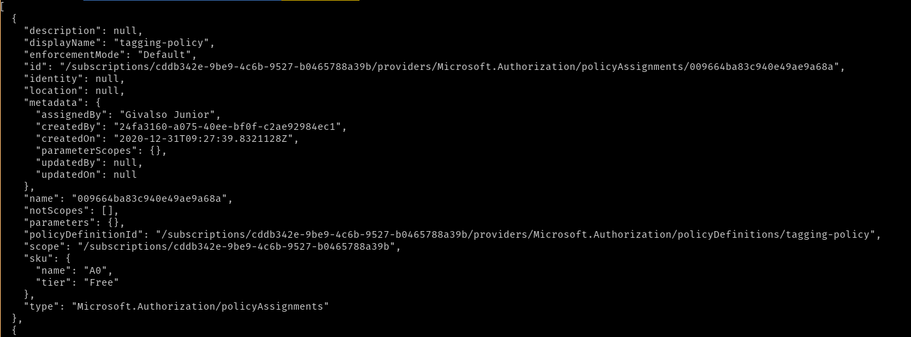

## Azure Infrastructure Operations Project: Deploying a scalable IaaS web server in Azure
The goal of this project is to create infra-as-code and deploy a web application on azure

This project will create infrastructure in azure and also deploly a 

In order to build this project I used azzure-cli, packer and terraform.

### Dependencies
> Make sure create the azure account and install all the dependencies before start building this project.  
- Create an Azure Account
- Install the [azure-cli](https://docs.microsoft.com/en-us/cli/azure/install-azure-cli)
- Install [Packer](https://www.packer.io)
- Install [Terraform](https://www.terraform.io)

### How to build and deploy this project
> Login to azure
```
az login
```

> Take a look at your account information, you will need the: subscription_id, client_secret and client_id for the **packer build** command
```
az account show
```

##### Build and deploy the vm image on/to azure using [packer](https://www.packer.io)
> run this command in the packer directory or pointing there 
```shell
packer build -var client_id="<azure-client-id>" -var client_secret="<azure-client-secret>" -var subscription_id="<azure-subscription-id>" server.json
```

##### Deploy the infrastructure on azure using [terraform](https://www.terraform.io)

Very important to know that you can change the values in the vars.tf, please see bellow a list of some variables.
Take a look in the file to see all of them.
 - Determines the username to be used in the vm: `username`
 - Determines the password to be used in the vm: `password`
 - Determines the tag name to b used to tag the resource in Azure: `project_name`
 - Determines the location(azure region) to be used to create the resources: `location`
 - Determines the amount of machine that you want to be created: `machine_count`

Let's start the process to create the infrastructure.

> run those command in the terraform directoryor pointing there
```shell
terraform validate 
```
> It`s posssible to change all the values in the vars.tf, just pass the desired values in the command line, see below
> run terraform plan to see what will be created
```shell
terraform plan -var 'username=<username>' -var 'password=<passwd>' -var 'machine_count=<number_of_machine_count>' -out=solution.plan
```

> after verying the plan, apply it to deploy the infra to azure
```shell
terraform apply solution.plan
```

> after the apply you check what has been created
```shell
terraform show
```

##### Test the deployed web-server
> You can get the public_ip of the loadbalancer that will show in the output as `lb_public_ip = <an ip>`

> You should see a `Hello, world!` messsage after running the command bellow.

`curl http://<public-ip>`


##### Policy assignment



##### Terraform Apply Output
This is the output of the infrastructure creation.
```
An execution plan has been generated and is shown below.
Resource actions are indicated with the following symbols:
  + create

Terraform will perform the following actions:

  # azurerm_availability_set.main will be created
  + resource "azurerm_availability_set" "main" {
      + id                           = (known after apply)
      + location                     = "westeurope"
      + managed                      = true
      + name                         = "udacity-aset"
      + platform_fault_domain_count  = 3
      + platform_update_domain_count = 5
      + resource_group_name          = "udacity-resources"
      + tags                         = {
          + "main_tag" = "Azure Infrastructure Operations Project"
        }
    }

  # azurerm_lb.main will be created
  + resource "azurerm_lb" "main" {
      + id                   = (known after apply)
      + location             = "westeurope"
      + name                 = "udacity-lb"
      + private_ip_address   = (known after apply)
      + private_ip_addresses = (known after apply)
      + resource_group_name  = "udacity-resources"
      + sku                  = "Standard"
      + tags                 = {
          + "main_tag" = "Azure Infrastructure Operations Project"
        }

      + frontend_ip_configuration {
          + id                            = (known after apply)
          + inbound_nat_rules             = (known after apply)
          + load_balancer_rules           = (known after apply)
          + name                          = "PublicIPAddress"
          + outbound_rules                = (known after apply)
          + private_ip_address            = (known after apply)
          + private_ip_address_allocation = (known after apply)
          + private_ip_address_version    = "IPv4"
          + public_ip_address_id          = (known after apply)
          + public_ip_prefix_id           = (known after apply)
          + subnet_id                     = (known after apply)
        }
    }

  # azurerm_lb_backend_address_pool.main will be created
  + resource "azurerm_lb_backend_address_pool" "main" {
      + backend_ip_configurations = (known after apply)
      + id                        = (known after apply)
      + load_balancing_rules      = (known after apply)
      + loadbalancer_id           = (known after apply)
      + name                      = "BackEndAddressPool"
      + outbound_rules            = (known after apply)
      + resource_group_name       = (known after apply)

      + backend_address {
          + ip_address         = (known after apply)
          + name               = (known after apply)
          + virtual_network_id = (known after apply)
        }
    }

  # azurerm_lb_outbound_rule.main will be created
  + resource "azurerm_lb_outbound_rule" "main" {
      + allocated_outbound_ports = 1024
      + backend_address_pool_id  = (known after apply)
      + enable_tcp_reset         = false
      + id                       = (known after apply)
      + idle_timeout_in_minutes  = 4
      + loadbalancer_id          = (known after apply)
      + name                     = "OutboundRule"
      + protocol                 = "All"
      + resource_group_name      = "udacity-resources"

      + frontend_ip_configuration {
          + id   = (known after apply)
          + name = "PublicIPAddress"
        }
    }

  # azurerm_lb_probe.main will be created
  + resource "azurerm_lb_probe" "main" {
      + id                  = (known after apply)
      + interval_in_seconds = 5
      + load_balancer_rules = (known after apply)
      + loadbalancer_id     = (known after apply)
      + name                = "http-check"
      + number_of_probes    = 2
      + port                = 80
      + protocol            = "Http"
      + request_path        = "/index.html"
      + resource_group_name = "udacity-resources"
    }

  # azurerm_lb_rule.main will be created
  + resource "azurerm_lb_rule" "main" {
      + backend_address_pool_id        = (known after apply)
      + backend_port                   = 80
      + disable_outbound_snat          = true
      + enable_floating_ip             = false
      + frontend_ip_configuration_id   = (known after apply)
      + frontend_ip_configuration_name = "PublicIPAddress"
      + frontend_port                  = 80
      + id                             = (known after apply)
      + idle_timeout_in_minutes        = (known after apply)
      + load_distribution              = (known after apply)
      + loadbalancer_id                = (known after apply)
      + name                           = "http"
      + probe_id                       = (known after apply)
      + protocol                       = "Tcp"
      + resource_group_name            = "udacity-resources"
    }

  # azurerm_linux_virtual_machine.main[0] will be created
  + resource "azurerm_linux_virtual_machine" "main" {
      + admin_password                  = (sensitive value)
      + admin_username                  = "gibas"
      + allow_extension_operations      = true
      + availability_set_id             = (known after apply)
      + computer_name                   = (known after apply)
      + disable_password_authentication = false
      + extensions_time_budget          = "PT1H30M"
      + id                              = (known after apply)
      + location                        = "westeurope"
      + max_bid_price                   = -1
      + name                            = "udacity-vm-0"
      + network_interface_ids           = (known after apply)
      + priority                        = "Regular"
      + private_ip_address              = (known after apply)
      + private_ip_addresses            = (known after apply)
      + provision_vm_agent              = true
      + public_ip_address               = (known after apply)
      + public_ip_addresses             = (known after apply)
      + resource_group_name             = "udacity-resources"
      + size                            = "Standard_B1s"
      + source_image_id                 = "/subscriptions/cddb342e-9be9-4c6b-9527-b0465788a39b/resourceGroups/packer-rg/providers/Microsoft.Compute/images/PackerUdacityImage"
      + tags                            = {
          + "main_tag" = "Azure Infrastructure Operations Project"
        }
      + virtual_machine_id              = (known after apply)
      + zone                            = (known after apply)

      + os_disk {
          + caching                   = "ReadWrite"
          + disk_size_gb              = (known after apply)
          + name                      = (known after apply)
          + storage_account_type      = "Standard_LRS"
          + write_accelerator_enabled = false
        }
    }

  # azurerm_linux_virtual_machine.main[1] will be created
  + resource "azurerm_linux_virtual_machine" "main" {
      + admin_password                  = (sensitive value)
      + admin_username                  = "gibas"
      + allow_extension_operations      = true
      + availability_set_id             = (known after apply)
      + computer_name                   = (known after apply)
      + disable_password_authentication = false
      + extensions_time_budget          = "PT1H30M"
      + id                              = (known after apply)
      + location                        = "westeurope"
      + max_bid_price                   = -1
      + name                            = "udacity-vm-1"
      + network_interface_ids           = (known after apply)
      + priority                        = "Regular"
      + private_ip_address              = (known after apply)
      + private_ip_addresses            = (known after apply)
      + provision_vm_agent              = true
      + public_ip_address               = (known after apply)
      + public_ip_addresses             = (known after apply)
      + resource_group_name             = "udacity-resources"
      + size                            = "Standard_B1s"
      + source_image_id                 = "/subscriptions/cddb342e-9be9-4c6b-9527-b0465788a39b/resourceGroups/packer-rg/providers/Microsoft.Compute/images/PackerUdacityImage"
      + tags                            = {
          + "main_tag" = "Azure Infrastructure Operations Project"
        }
      + virtual_machine_id              = (known after apply)
      + zone                            = (known after apply)

      + os_disk {
          + caching                   = "ReadWrite"
          + disk_size_gb              = (known after apply)
          + name                      = (known after apply)
          + storage_account_type      = "Standard_LRS"
          + write_accelerator_enabled = false
        }
    }

  # azurerm_linux_virtual_machine.main[2] will be created
  + resource "azurerm_linux_virtual_machine" "main" {
      + admin_password                  = (sensitive value)
      + admin_username                  = "gibas"
      + allow_extension_operations      = true
      + availability_set_id             = (known after apply)
      + computer_name                   = (known after apply)
      + disable_password_authentication = false
      + extensions_time_budget          = "PT1H30M"
      + id                              = (known after apply)
      + location                        = "westeurope"
      + max_bid_price                   = -1
      + name                            = "udacity-vm-2"
      + network_interface_ids           = (known after apply)
      + priority                        = "Regular"
      + private_ip_address              = (known after apply)
      + private_ip_addresses            = (known after apply)
      + provision_vm_agent              = true
      + public_ip_address               = (known after apply)
      + public_ip_addresses             = (known after apply)
      + resource_group_name             = "udacity-resources"
      + size                            = "Standard_B1s"
      + source_image_id                 = "/subscriptions/cddb342e-9be9-4c6b-9527-b0465788a39b/resourceGroups/packer-rg/providers/Microsoft.Compute/images/PackerUdacityImage"
      + tags                            = {
          + "main_tag" = "Azure Infrastructure Operations Project"
        }
      + virtual_machine_id              = (known after apply)
      + zone                            = (known after apply)

      + os_disk {
          + caching                   = "ReadWrite"
          + disk_size_gb              = (known after apply)
          + name                      = (known after apply)
          + storage_account_type      = "Standard_LRS"
          + write_accelerator_enabled = false
        }
    }

  # azurerm_managed_disk.main[0] will be created
  + resource "azurerm_managed_disk" "main" {
      + create_option        = "Empty"
      + disk_iops_read_write = (known after apply)
      + disk_mbps_read_write = (known after apply)
      + disk_size_gb         = 10
      + id                   = (known after apply)
      + location             = "westeurope"
      + name                 = "udacity-vm-0-disk"
      + resource_group_name  = "udacity-resources"
      + source_uri           = (known after apply)
      + storage_account_type = "Standard_LRS"
      + tags                 = {
          + "main_tag" = "Azure Infrastructure Operations Project"
        }
    }

  # azurerm_managed_disk.main[1] will be created
  + resource "azurerm_managed_disk" "main" {
      + create_option        = "Empty"
      + disk_iops_read_write = (known after apply)
      + disk_mbps_read_write = (known after apply)
      + disk_size_gb         = 10
      + id                   = (known after apply)
      + location             = "westeurope"
      + name                 = "udacity-vm-1-disk"
      + resource_group_name  = "udacity-resources"
      + source_uri           = (known after apply)
      + storage_account_type = "Standard_LRS"
      + tags                 = {
          + "main_tag" = "Azure Infrastructure Operations Project"
        }
    }

  # azurerm_managed_disk.main[2] will be created
  + resource "azurerm_managed_disk" "main" {
      + create_option        = "Empty"
      + disk_iops_read_write = (known after apply)
      + disk_mbps_read_write = (known after apply)
      + disk_size_gb         = 10
      + id                   = (known after apply)
      + location             = "westeurope"
      + name                 = "udacity-vm-2-disk"
      + resource_group_name  = "udacity-resources"
      + source_uri           = (known after apply)
      + storage_account_type = "Standard_LRS"
      + tags                 = {
          + "main_tag" = "Azure Infrastructure Operations Project"
        }
    }

  # azurerm_network_interface.main[0] will be created
  + resource "azurerm_network_interface" "main" {
      + applied_dns_servers           = (known after apply)
      + dns_servers                   = (known after apply)
      + enable_accelerated_networking = false
      + enable_ip_forwarding          = false
      + id                            = (known after apply)
      + internal_dns_name_label       = (known after apply)
      + internal_domain_name_suffix   = (known after apply)
      + location                      = "westeurope"
      + mac_address                   = (known after apply)
      + name                          = "udacity-0-nic"
      + private_ip_address            = (known after apply)
      + private_ip_addresses          = (known after apply)
      + resource_group_name           = "udacity-resources"
      + tags                          = {
          + "main_tag" = "Azure Infrastructure Operations Project"
        }
      + virtual_machine_id            = (known after apply)

      + ip_configuration {
          + name                          = "udacity"
          + primary                       = (known after apply)
          + private_ip_address            = (known after apply)
          + private_ip_address_allocation = "dynamic"
          + private_ip_address_version    = "IPv4"
          + subnet_id                     = (known after apply)
        }
    }

  # azurerm_network_interface.main[1] will be created
  + resource "azurerm_network_interface" "main" {
      + applied_dns_servers           = (known after apply)
      + dns_servers                   = (known after apply)
      + enable_accelerated_networking = false
      + enable_ip_forwarding          = false
      + id                            = (known after apply)
      + internal_dns_name_label       = (known after apply)
      + internal_domain_name_suffix   = (known after apply)
      + location                      = "westeurope"
      + mac_address                   = (known after apply)
      + name                          = "udacity-1-nic"
      + private_ip_address            = (known after apply)
      + private_ip_addresses          = (known after apply)
      + resource_group_name           = "udacity-resources"
      + tags                          = {
          + "main_tag" = "Azure Infrastructure Operations Project"
        }
      + virtual_machine_id            = (known after apply)

      + ip_configuration {
          + name                          = "udacity"
          + primary                       = (known after apply)
          + private_ip_address            = (known after apply)
          + private_ip_address_allocation = "dynamic"
          + private_ip_address_version    = "IPv4"
          + subnet_id                     = (known after apply)
        }
    }

  # azurerm_network_interface.main[2] will be created
  + resource "azurerm_network_interface" "main" {
      + applied_dns_servers           = (known after apply)
      + dns_servers                   = (known after apply)
      + enable_accelerated_networking = false
      + enable_ip_forwarding          = false
      + id                            = (known after apply)
      + internal_dns_name_label       = (known after apply)
      + internal_domain_name_suffix   = (known after apply)
      + location                      = "westeurope"
      + mac_address                   = (known after apply)
      + name                          = "udacity-2-nic"
      + private_ip_address            = (known after apply)
      + private_ip_addresses          = (known after apply)
      + resource_group_name           = "udacity-resources"
      + tags                          = {
          + "main_tag" = "Azure Infrastructure Operations Project"
        }
      + virtual_machine_id            = (known after apply)

      + ip_configuration {
          + name                          = "udacity"
          + primary                       = (known after apply)
          + private_ip_address            = (known after apply)
          + private_ip_address_allocation = "dynamic"
          + private_ip_address_version    = "IPv4"
          + subnet_id                     = (known after apply)
        }
    }

  # azurerm_network_interface_backend_address_pool_association.main[0] will be created
  + resource "azurerm_network_interface_backend_address_pool_association" "main" {
      + backend_address_pool_id = (known after apply)
      + id                      = (known after apply)
      + ip_configuration_name   = "udacity"
      + network_interface_id    = (known after apply)
    }

  # azurerm_network_interface_backend_address_pool_association.main[1] will be created
  + resource "azurerm_network_interface_backend_address_pool_association" "main" {
      + backend_address_pool_id = (known after apply)
      + id                      = (known after apply)
      + ip_configuration_name   = "udacity"
      + network_interface_id    = (known after apply)
    }

  # azurerm_network_interface_backend_address_pool_association.main[2] will be created
  + resource "azurerm_network_interface_backend_address_pool_association" "main" {
      + backend_address_pool_id = (known after apply)
      + id                      = (known after apply)
      + ip_configuration_name   = "udacity"
      + network_interface_id    = (known after apply)
    }

  # azurerm_network_interface_security_group_association.main[0] will be created
  + resource "azurerm_network_interface_security_group_association" "main" {
      + id                        = (known after apply)
      + network_interface_id      = (known after apply)
      + network_security_group_id = (known after apply)
    }

  # azurerm_network_interface_security_group_association.main[1] will be created
  + resource "azurerm_network_interface_security_group_association" "main" {
      + id                        = (known after apply)
      + network_interface_id      = (known after apply)
      + network_security_group_id = (known after apply)
    }

  # azurerm_network_interface_security_group_association.main[2] will be created
  + resource "azurerm_network_interface_security_group_association" "main" {
      + id                        = (known after apply)
      + network_interface_id      = (known after apply)
      + network_security_group_id = (known after apply)
    }

  # azurerm_network_security_group.security_group will be created
  + resource "azurerm_network_security_group" "security_group" {
      + id                  = (known after apply)
      + location            = "westeurope"
      + name                = "UdacityCourseSecurityGroup"
      + resource_group_name = "udacity-resources"
      + security_rule       = [
          + {
              + access                                     = "Allow"
              + description                                = ""
              + destination_address_prefix                 = "*"
              + destination_address_prefixes               = []
              + destination_application_security_group_ids = []
              + destination_port_range                     = "80"
              + destination_port_ranges                    = []
              + direction                                  = "Inbound"
              + name                                       = "AllowAccessFromTheInternetInPort80"
              + priority                                   = 101
              + protocol                                   = "tcp"
              + source_address_prefix                      = "*"
              + source_address_prefixes                    = []
              + source_application_security_group_ids      = []
              + source_port_range                          = "*"
              + source_port_ranges                         = []
            },
          + {
              + access                                     = "Allow"
              + description                                = ""
              + destination_address_prefix                 = "VirtualNetwork"
              + destination_address_prefixes               = []
              + destination_application_security_group_ids = []
              + destination_port_range                     = "*"
              + destination_port_ranges                    = []
              + direction                                  = "Inbound"
              + name                                       = "AllowAccessFromTheSubnet"
              + priority                                   = 100
              + protocol                                   = "*"
              + source_address_prefix                      = "VirtualNetwork"
              + source_address_prefixes                    = []
              + source_application_security_group_ids      = []
              + source_port_range                          = "*"
              + source_port_ranges                         = []
            },
          + {
              + access                                     = "Deny"
              + description                                = ""
              + destination_address_prefix                 = "VirtualNetwork"
              + destination_address_prefixes               = []
              + destination_application_security_group_ids = []
              + destination_port_range                     = "*"
              + destination_port_ranges                    = []
              + direction                                  = "Inbound"
              + name                                       = "DenyAccessFromTheInternet"
              + priority                                   = 1002
              + protocol                                   = "*"
              + source_address_prefix                      = "Internet"
              + source_address_prefixes                    = []
              + source_application_security_group_ids      = []
              + source_port_range                          = "*"
              + source_port_ranges                         = []
            },
        ]
      + tags                = {
          + "main_tag" = "Azure Infrastructure Operations Project"
        }
    }

  # azurerm_public_ip.lb_public_ip will be created
  + resource "azurerm_public_ip" "lb_public_ip" {
      + allocation_method       = "Static"
      + fqdn                    = (known after apply)
      + id                      = (known after apply)
      + idle_timeout_in_minutes = 4
      + ip_address              = (known after apply)
      + ip_version              = "IPv4"
      + location                = "westeurope"
      + name                    = "lb-public-ip"
      + resource_group_name     = "udacity-resources"
      + sku                     = "Standard"
      + tags                    = {
          + "main_tag" = "Azure Infrastructure Operations Project"
        }
    }

  # azurerm_resource_group.main will be created
  + resource "azurerm_resource_group" "main" {
      + id       = (known after apply)
      + location = "westeurope"
      + name     = "udacity-resources"
      + tags     = {
          + "main_tag" = "Azure Infrastructure Operations Project"
        }
    }

  # azurerm_subnet.main will be created
  + resource "azurerm_subnet" "main" {
      + address_prefix                                 = (known after apply)
      + address_prefixes                               = [
          + "10.0.0.0/24",
        ]
      + enforce_private_link_endpoint_network_policies = false
      + enforce_private_link_service_network_policies  = false
      + id                                             = (known after apply)
      + name                                           = "main"
      + resource_group_name                            = "udacity-resources"
      + virtual_network_name                           = "udacity-network"
    }

  # azurerm_virtual_machine_data_disk_attachment.main[0] will be created
  + resource "azurerm_virtual_machine_data_disk_attachment" "main" {
      + caching                   = "ReadWrite"
      + create_option             = "Attach"
      + id                        = (known after apply)
      + lun                       = 10
      + managed_disk_id           = (known after apply)
      + virtual_machine_id        = (known after apply)
      + write_accelerator_enabled = false
    }

  # azurerm_virtual_machine_data_disk_attachment.main[1] will be created
  + resource "azurerm_virtual_machine_data_disk_attachment" "main" {
      + caching                   = "ReadWrite"
      + create_option             = "Attach"
      + id                        = (known after apply)
      + lun                       = 10
      + managed_disk_id           = (known after apply)
      + virtual_machine_id        = (known after apply)
      + write_accelerator_enabled = false
    }

  # azurerm_virtual_machine_data_disk_attachment.main[2] will be created
  + resource "azurerm_virtual_machine_data_disk_attachment" "main" {
      + caching                   = "ReadWrite"
      + create_option             = "Attach"
      + id                        = (known after apply)
      + lun                       = 10
      + managed_disk_id           = (known after apply)
      + virtual_machine_id        = (known after apply)
      + write_accelerator_enabled = false
    }

  # azurerm_virtual_network.main will be created
  + resource "azurerm_virtual_network" "main" {
      + address_space         = [
          + "10.0.0.0/24",
        ]
      + guid                  = (known after apply)
      + id                    = (known after apply)
      + location              = "westeurope"
      + name                  = "udacity-network"
      + resource_group_name   = "udacity-resources"
      + subnet                = (known after apply)
      + vm_protection_enabled = false
    }

Plan: 29 to add, 0 to change, 0 to destroy.
```