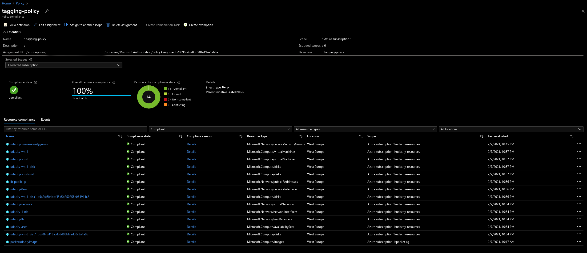

## Azure Infrastructure Operations Project: Deploying a scalable IaaS web server in Azure
The goal of this project is to create infra-as-code and deploy a web application on azure

This project will create infrastructure in azure and also deploly a 

In order to build this project I used azzure-cli, packer and terraform.

### Dependencies
> Make sure create the azure account and install all the dependencies before start building this project.  
- Create an Azure Account
- Install the [azure-cli](https://docs.microsoft.com/en-us/cli/azure/install-azure-cli)
- Install [Packer](https://www.packer.io)
- Install [Terraform](https://www.terraform.io)

### How to build and deploy this project
> Login to azure
```
az login
```

> Take a look at your account information, you will need the: subscription_id, client_secret and client_id for the **packer build** command
```
az account show
```

##### Build and deploy the vm image on/to azure using [packer](https://www.packer.io)
> run this command in the packer directory or pointing there 
```shell
packer build -var client_id="<azure-client-id>" -var client_secret="<azure-client-secret>" -var subscription_id="<azure-subscription-id>" server.json
```

##### Deploy the infrastructure on azure using [terraform](https://www.terraform.io)

Very important to know that you can change the values in the vars.tf, please see bellow a list of some variables.
Take a look in the file to see all of them.
 - Determines the username to be used in the vm: `username`
 - Determines the password to be used in the vm: `password`
 - Determines the tag name to b used to tag the resource in Azure: `project_name`
 - Determines the location(azure region) to be used to create the resources: `location`
 - Determines the amount of machine that you want to be created: `machine_count`

Let's start the process to create the infrastructure.

> run those command in the terraform directoryor pointing there
```shell
terraform validate 
```
> It`s posssible to change all the values in the vars.tf, just pass the desired values in the command line, see below
> run terraform plan to see what will be created
```shell
terraform plan -var 'username=<username>' -var 'password=<passwd>' -var 'machine_count=<number_of_machine_count>' -out=solution.plan
```

> after verying the plan, apply it to deploy the infra to azure
```shell
terraform apply solution.plan
```

> after the apply you check what has been created
```shell
terraform show
```

##### Test the deployed web-server
> You can get the public_ip of the loadbalancer that will show in the output as `lb_public_ip = <an ip>`

> You should see a `Hello, world!` messsage after running the command bellow.

`curl http://<public-ip>`

##### Tagging policy created


##### Policy assignment


#####  graph of the expected infrastructure template
